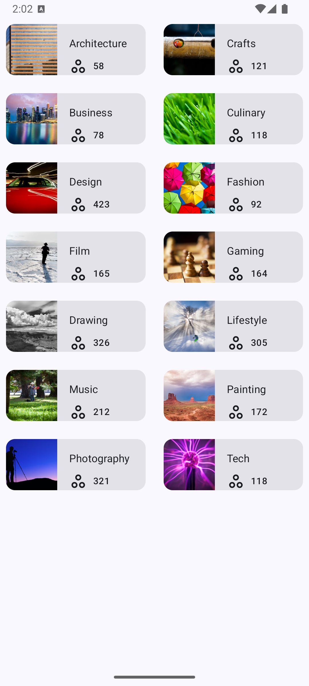

Topic Grid App
=================================

[Tutorial Link for Adaptive App Icons](https://developer.android.com/codelabs/basic-android-kotlin-compose-training-change-app-icon?continue=https%3A%2F%2Fdeveloper.android.com%2Fcourses%2Fpathways%2Fandroid-basics-compose-unit-3-pathway-2%23codelab-https%3A%2F%2Fdeveloper.android.com%2Fcodelabs%2Fbasic-android-kotlin-compose-training-change-app-icon#4)

    

Introduction
------------
This app is a practise for lists, and introduces using grid scrollable layout

Concepts Covered
--------------
* Practises using DataSources for list source
* Using models
* Usage of statusBarsPadding, WindowInsets and LocalLayoutDirection
* Usage of ContentScale.Crop
* LazyVerticalGrid using columns 2
